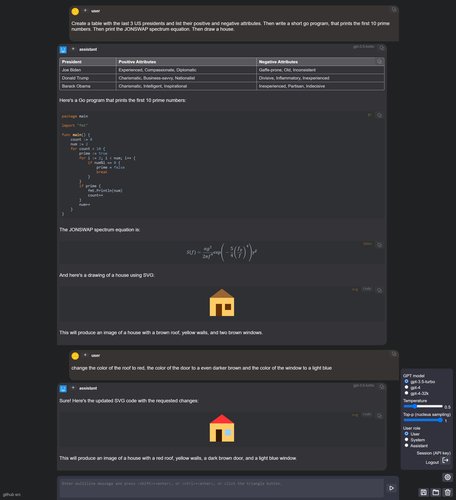

# AIFlow Chat

A chat application with flows, agents and MCP support, that interacts with AI models via the OpenAI-compatible API.

> **Warning**: This tool is in development, made as a spare time project, and no warranty is given for any functionality.

Key capabilities include:
- **AI Interactions**: Stream responses from AI models. Generate text, tables, code, formulas (via LaTeX), and simple SVG images/charts.
- **Tool Support**: Integrate external tools (e.g., web search) using MCP for real-time data fetching.
- **Formatting & Usability**: Render Markdown, highlight code, display math equations, and add citations for tool outputs.
- **Chat Management**: Multiple chats with save/load, editing/deleting messages, alternative responses, and branching conversations.

### Usage

#### Online Demo
Test a (sometimes outdated version) at: [https://huggingface.co/spaces/dma123/aiflow-chat](https://huggingface.co/spaces/dma123/aiflow-chat).

#### Local Setup
1. Clone the repo: `git clone https://github.com/dmatscheko/aiflow-chat.git`
2. Run a simple HTTP server: `python -m http.server 8000` (or use any static file server).
3. Open `http://localhost:8000` in your browser.

#### With MCP (for Tools)
To enable advanced tools like web/X search:
1. Clone the repo: `git clone https://github.com/dmatscheko/aiflow-chat.git`
2. Customize tools via `mcp_config.json`.
3. Run: `uv run main.py` (or `pip install fastmcp fastapi` and `python main.py`). This starts a web server at http://localhost:8000, a local MCP proxy at `http://localhost:3000/mcp`, and auto-configures the app.
4. Open `http://localhost:8000` in your browser, if it is not automatically openend.

#### Controls
- **Input**: Type messages; use Shift+Enter (or Ctrl/Alt+Enter) to submit. Press Esc to abort AI responses.
- **Chats**: Sidebar for multiple chats; edit titles, add/delete messages, navigate alternatives.
- **Settings**: Tune sampling (temperature/top-p), manage API endpoints, refresh models, select role (user/system/assistant/tool).
- **Avatars**: Click message avatars to upload custom images (stored locally).

### Screenshot
This screenshot was "randomly selected" because its output was ok-ish ;)

